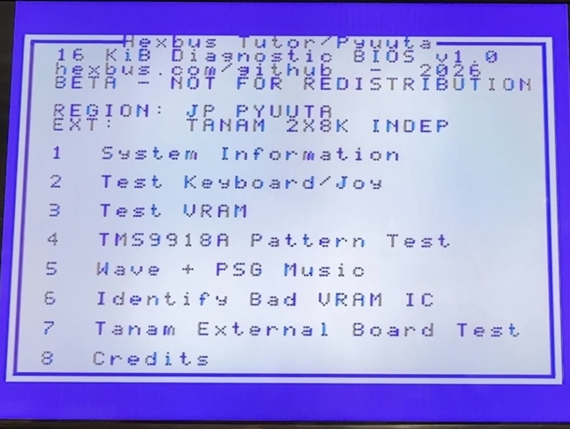
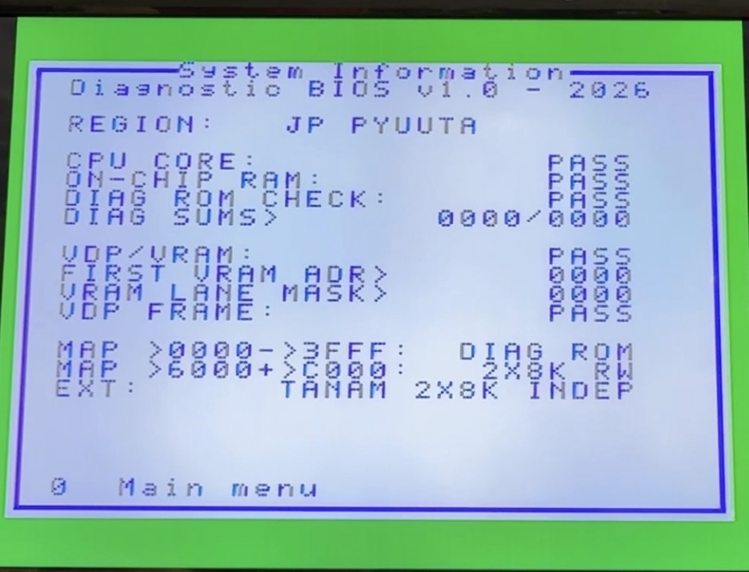
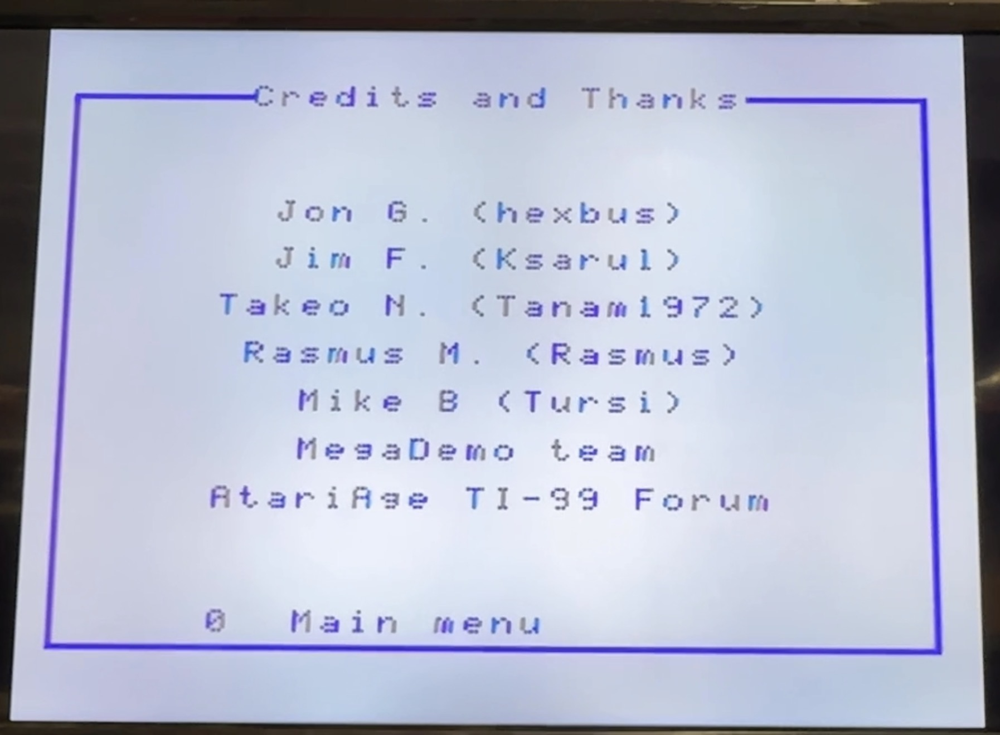

<!-- SPDX-License-Identifier: CC-BY-4.0 -->
# Tutor / Pyuuta 16 KiB diagnostic BIOS

This repository builds a cold-start diagnostic ROM for an American Tomy Tutor or an original Japanese Tomy Pyuuta. The v1.0 ROM is designed for either a **direct internal BIOS replacement** or an **external BIOS replacement** through hardware such as Tanam's ESE or a future Hexbus diagnostic cartridge in the rear expansion slot. The ROM itself does not call the stock BIOS, use external CPU RAM, or trust VRAM before testing it.





> **HARDWARE CAUTION.** v1.0 performs destructive memory tests. It has been exercised on physical hardware, but electrical and cross-revision qualification remains incomplete. Archive the original ROM and verify device pinout, supply, orientation, and output-disable behavior before installation.

## What the current prototype implements

| Area | Current behavior |
| --- | --- |
| Cold start | TMS9995 vectors at `>0000`; interrupts masked; no stack; two on-chip workspaces |
| CPU RAM | destructive address-dependent, `0000`, `FFFF`, `AAAA`, and `5555` tests across usable `>F000->F0FB` |
| CPU core | representative add, compare, XOR, shift, invert, branch, and workspace behavior |
| ROM | forward and reverse 16 KiB additive word checksums with build-time correction; fixed marker `>D1A6` |
| VDP/VRAM | cold-start data/address sweeps; menu-selected GUI-restoring 64-block scrub; strict whole-array 17N March-B; first address and lane mask |
| VRAM isolation | first failing VRAM address and data-lane mask; an on-screen 2-by-4 chip drawing follows the supplied Tutor photo, with a revision-qualified TP1000 lane lookup |
| Video | dark-blue-on-white Tomy-inspired menu, private square-corner/joined-rail UI glyphs, real lowercase, Graphics I, Text, Multicolor, streaming patterns, sprite motion/size/magnification, collision/fifth-sprite exercise, and the approved MegaDemo-derived red/white/green raster wave |
| Timing | bounded TMS9918 VBlank-status polling; no assumption that the unconnected TP1000 VDP interrupt pin fires |
| Audio | startup signature, channel/noise walk, pass/failure sounds, and an approved MegaDemo high-energy PSG passage looped on its exact 224-frame beat boundary for 29.897 seconds; `0` immediately mutes it |
| Input | separate keyboard and controller pages; native shifted chords and replacement-PCB contacts are decoded; both Shift switches share R6B2 by design; controller ports are read directly at their physical `>EC40`/`>EC50` matrix rows |
| Expansion | non-destructive discovery of independent `>6000` and `>C000` windows; confirmed destructive one-pass or continuous 17N March-B over all 16 KiB when detected |
| Regions | separate Tutor and Pyuuta builds from one engine; the correct physical legend is selected before programming |
| Deployment | direct internal ROM replacement, Tanam ESE external override, or a qualified rear-slot diagnostic cartridge |

The `Hexbus Tutor/Pyuuta` menu displays `github.com/hexbus`, `RELEASE v1.0 - USE WITH CARE`, region, detected expansion, and eight choices. Pressing a menu number immediately bolds only that numeral, sounds a short TI-style acknowledgement beep, and pauses briefly before opening the selection. Automatic startup results are kept on the dedicated System Information page rather than repeated on the menu:

1. System Information with aligned CPU, on-chip RAM, ROM, VDP/VRAM, timing, checksum, memory-map, and extension results.
2. Test Keyboard/Joy with independent keyboard and joystick/controller screens.
3. Test VRAM: a screen-preserving 64-block test, one strict full-array March-B pass, or continuous March-B until `0`. Full tests show a warning and three-second countdown, then hold a separate ready page for about two seconds before testing; holding `0` during the warning cancels.
4. TMS9918A Pattern Test with sprite choreography, Text and Multicolor scenes, tile streaming, a silent three-second Graphics-I red/white/green raster-wave exercise, and a plain-language result page.
5. A 29.897-second combined Wave + PSG Music Test using the approved MegaDemo raster technique and high-energy captured writes; `0` stops and mutes it.
6. Identify Bad VRAM IC using a board-qualified, boxed 2x4 package drawing. Each package distinguishes its PCB identifier (`IC:D1`) from its software data lane (`D0`), and a star marks the suspected package.
7. Optional destructive Tanam External Board Test covering both independent 8 KiB windows.
8. Credits and Thanks for the people and AtariAge community who contributed knowledge, testing, and prior work.

The first physical keyboard report is unusually diagnostic: `Q`, `E`, `T`, `9`, `O`, the PC-keycap `=`/`+` position over the native degree/Yen contact, Shift, and Down are respectively `R0B2` through `R7B2`. A complete one-contact-per-row failure on bit 2 points toward their shared matrix/input path rather than eight coincidentally worn switches. The replacement PCB confirms that its two Shift switches intentionally share R6B2 and that its PC legends do not electronically remap the native contacts. See the [keyboard matrix notes](docs/KEYBOARD-CONTROLLER-MATRIX.md) and [first-boot findings](docs/FIRST-PHYSICAL-BOOT.md).

Not yet claimed: complete cross-revision physical qualification, a verified Japanese keycap-to-kana overlay, TMS9995 decrementer calibration, a distinct positive ESE identity probe, or exhaustive validation of every undocumented VDP combination.

## Choose the image

- American Tutor release: `release/v1.0/tutor-diag-w27c512.bin`
- Original Japanese Pyuuta release: `release/v1.0/pyuuta-diag-w27c512.bin`
- Rebuilt 16 KiB cores and programmer files: `build/`

The 64 KiB programmer files contain four identical copies of the 16 KiB core at file offsets `>0000`, `>4000`, `>8000`, and `>C000`. This removes A14/A15 selection ambiguity; it does **not** prove that a W27C512 is pin-compatible with every board revision.

## Build and test

Requirements are PowerShell, Python 3, [xdt99](https://github.com/endlos99/xdt99), Node.js, and the sibling JS99er/harness dependencies already used by this repository.

```powershell
./build.ps1
./test.ps1
```

`build.ps1` accepts `-AssemblerPath` and `-PythonPath`; the equivalent environment variables are `XAS99_PATH` and `TOMY_DIAG_PYTHON`. By default it looks for a sibling `xdt99` repository and a Python 3 launcher. The optional emulator suite accepts `JS99ER_PATH` and `TOMY_DIAG_HARNESS_PATH`, defaulting to sibling repositories.

The build rejects incorrect hand-counted display-string lengths, requires exactly 16,384 output bytes, verifies reset workspace `>F0A0`, checks the `>D1A6` marker, patches and rechecks the zero word-sum, and emits SHA-256 hashes. It contains no build timestamp, so identical source/tool inputs produce identical binary and manifest content.

The PowerShell and Node files are host-side build and regression conveniences,
not dependencies of the ROM. The portable implementation is in `src/`:
`t_diag.a99` and `p_diag.a99` select the regional keyboard legend and include
the shared `diag.a99` engine. All source names fit the TI ten-character filename
limit. A future TI-hosted assembler
port can use those assembly sources directly, adapting only assembler directives
where required; release metadata and permission records are not assembly inputs.

The emulator suite exercises both regions on stock and Tanam maps, all eight menu acknowledgements, centered title-case headings, the complete credits page, injected VRAM D7 failure and boxed chip drawing, Shift, Shift+0 equals, Shift+semicolon plus, short/long zero behavior, held-MOD native/PC keycap switching, both physical controller rows, system/results pages, the full-test warning, one-pass and interruptible continuous VRAM March-B, all 64 visible-scrub blocks, the complete VDP scene sequence, complete and interrupted PSG music, and one-pass plus interruptible continuous Tanam March-B.

## Music/reference boundary

These v1.0 binaries contain a compact high-energy PSG loop captured around MegaDemo frames 16820 through 17044 plus an adaptation of its bank-18 raster-wave technique and small pattern/sine assets. The original MegaDemo player, text, and complete executable banks are not included. Jon reports that Rasmus/ASMUSR wrote the green-line effect and knowingly approved its reuse in both the Pyuuta/Tutor and TI-99 diagnostic ROMs; the PSG passage was likewise approved for this diagnostic-hardware use. The ROM credits Rasmus and the MegaDemo team. See [reference provenance](docs/PROVENANCE.md).

## Safety and deployment order

1. Read and archive the original system ROM before removal.
2. Follow the [physical checklist](docs/PHYSICAL-TEST-CHECKLIST.md).
3. Qualify the direct internal replacement first.
4. Treat any external ROM adapter as separate, electrically unqualified hardware. The companion design lives in the `tomy-diag-cartridge` repository.
5. Keep the future stock-BIOS handoff separate. CPU `>FFFC` is on-chip NMI-vector storage, not ordinary rear-port ROM.

## Documentation

- [Architecture](docs/ARCHITECTURE.md)
- [Building and assembler portability](docs/BUILDING.md)
- [VRAM chip/lane lookup](docs/VRAM-CHIP-LANE-LOOKUP.md)
- [Keyboard and controller matrix](docs/KEYBOARD-CONTROLLER-MATRIX.md)
- [Physical test checklist](docs/PHYSICAL-TEST-CHECKLIST.md)
- [Reference provenance and licensing](docs/PROVENANCE.md)

No Tomy or Texas Instruments firmware is included.
