<!-- SPDX-License-Identifier: CC-BY-4.0 -->
# Tutor/Pyuuta 16 KiB diagnostic BIOS architecture

Status: implementation baseline, 2026-08-31. Evidence labels are **confirmed**, **reported**, **inferred**, and **open**.

## Scope and deployment order

The diagnostic is a raw 16 KiB BIOS image mapped at CPU `>0000->3FFF`; it contains the TMS9995 reset vectors at `>0000`, uses only TMS9995 on-chip RAM for CPU state, and does not depend on routines in the stock BIOS, external CPU RAM, cassette, or working VRAM.

The physical stock system-ROM decode spans `>0000->7FFF` and the documented mid-production TP1000 board uses a 28-pin 256-Kbit ROM. A 16 KiB diagnostic therefore needs either a socket adapter/EPROM whose unused upper address input is strapped correctly, or a programmer image in which the 16 KiB core is repeated so every selected physical quarter is identical. The build emits both forms.

There are exactly three intended ways to place this diagnostic BIOS in the system address space:

1. Direct replacement of the internal BIOS ROM. This is currently usable with the correct programmed device or adapter for the exact motherboard revision.
2. External BIOS replacement through a Tanam ESE board. This is currently usable while the internal BIOS remains installed.
3. The future Hexbus rear-slot diagnostic cartridge. This hardware is still under development and is neither released nor electrically qualified.

No compatibility is claimed for a bare rear-slot connection, an ordinary game cartridge, a generic EPROM adapter, or a speculative stock-BIOS handoff. CPU `>FFFC->FFFF` is the TMS9995 on-chip NMI vector, not ordinary rear-port ROM.

## Hardware facts that shape the firmware

- **Confirmed:** TMS9995 CPU, TMS9918-family VDP with 16 KiB VRAM, and SN76489-family PSG.
- **Confirmed:** stock CPU-writable memory is the TMS9995's 256-byte on-chip RAM, principally `>F000->F0FB`, with the decrementer at `>FFFA->FFFB` and NMI vector at `>FFFC->FFFF`. There is no stock 16 KiB general CPU RAM.
- **Confirmed:** VDP data/control ports are `>E000`/`>E002`, and PSG writes use `>E200`.
- **Confirmed for the supplied TP1000 schematic:** the VDP interrupt output is not connected. VBlank polling and the TMS9995 decrementer are therefore distinct timing tests; the ROM must not wait for a VDP interrupt that cannot arrive.
- **Confirmed:** keyboard inputs are eight asserted-high CRU rows at logical `>EC00->EC7E`.
- **Confirmed from the stock-compatible scanner and physical diagnostic feedback:** Player 1 is the asserted-high matrix row at `>EC40` and Player 2 is `>EC50`. These rows carry D/L/U/R in bits 4..7 and the SL/SR contacts in bits 2/3; no TI-style CRU output-column latch is involved.
- **Physically confirmed in this project:** Tanam `>6000->7FFF` and `>C000->DFFF` are independent, simultaneous 8 KiB read/write windows on the tested Tutor/Tanam profile.
- **Reported and photograph-supported:** Pyuuta Mk II is a transitional one-ROM machine. Its sole ROM is reported identical to Tutor `TUTOR-1` v2.3; it has no onboard `TUTOR-2` BASIC ROM or footprint, and its dedicated BASIC-1 cartridge occupies the missing BASIC range.
- **Photograph-confirmed:** the American Tutor population shown in the hardware record carries separate soldered `TUTOR-1` and `TUTOR-2` ROMs.
- **Photograph-supported:** Pyuuta Jr is a compact, cost-reduced console redesign that retains the CPU/VDP/PSG/VRAM core while omitting substantial keyboard and expansion logic. Jr is not currently a claimed target.
- **Open by model/revision:** whether every Tutor, original Pyuuta, Mk II, and Jr has identical ROM-socket and rear-connector wiring. No universal PCB pinout is claimed yet.

## Region strategy

The low-level CPU, VDP, PSG, CRU, and controller hardware interface is common enough for one code base. The machine provides no reliable region identity after its stock BIOS has been replaced, and Japanese and American keyboard legends/character semantics differ. The safer release format is therefore two generated images:

- `tutor-diag-16k.bin`: American Tutor labeling.
- `pyuuta-diag-16k.bin`: Japanese Pyuuta labeling and matrix legend.

The executable test engine is shared. Only the build identifier and presentation tables differ. A universal image remains technically possible with a boot-time selection, but it would give the wrong default when the keyboard is defective - exactly the condition this ROM must tolerate.

## Execution before RAM and video are trusted

Reset selects workspace `>F0A0` and masks interrupts. The early path uses registers only: no stack, external RAM, VRAM, stock-ROM call, or interrupt handler.

1. Mute the PSG, then emit a short startup signature so execution is externally observable.
2. Exercise the on-chip RAM outside the active workspace with address-dependent and alternating patterns.
3. Move the workspace into an already-tested block and test the original workspace.
4. If either phase fails, loop forever with a red-border attempt and a repeating sound code. Video is helpful but not required.
5. Initialize the VDP with display disabled and destructively test VRAM.
6. Load the ROM-resident diagnostic font and render the durable summary.

Because a workspace is memory mapped on the TMS9900 family, it is impossible to test the active 32-byte workspace while simultaneously using it. The two-workspace handoff covers both blocks without relying on untested memory.

## Result storage and failure signaling

After on-chip RAM passes, a small result record lives in `>F000->F03F`. It contains stage, cumulative failure flags, first failing address, expected/actual data, failing bit mask, detected extension flags, and timing counts. The record never depends on external RAM.

Signals are deliberately redundant:

- border/background color: blue = running, green = pass, yellow = optional/untested, red = failure;
- PSG pattern: startup chirp, three-channel/noise walk, rising pass pair, and fault noise;
- stable screen summary when VRAM permits;
- tight, documented halt loops suitable for logic-analyzer observation when both video and audio paths are bad.

## Automated destructive tests

The direct BIOS owns stock VRAM and on-chip RAM, so its cold-start tests are destructive to both. No user data is promised to survive booting a diagnostic BIOS.

The extension discovery probe is non-destructive: it saves one word from each candidate window, writes complementary address-dependent patterns, verifies independence, and restores both words before interpreting the result. A full extension-memory march is separate and opt-in because it destroys the detected SRAM contents.

## Test modules

### CPU and on-chip RAM

- reset/vector execution and representative arithmetic/logic/branch checks;
- two-workspace on-chip RAM data-pattern test;
- address-dependent and alternating data tests;
- forward/reverse ROM-wide additive checksums and fixed build marker;
- ROM address/bus sanity through fixed sentinels and checksum disagreement.

### VDP and VRAM

- command-latch reset and conservative access recovery cadence;
- VDP register initialization with display disabled;
- VRAM data patterns (`00`, `FF`, `AA`, `55`, walking ones and zeros);
- address-line sentinels at powers of two through all 14 VRAM address bits;
- destructive full-memory fill/read transitions over all 16 KiB;
- a GUI-restoring local March-B scrub over 64 × 256-byte blocks;
- a strict whole-array 17N March-B: `w0`; ascending `(r0,w1,r1,w0,r0,w1)`; ascending `(r1,w0,w1)`; descending `(r1,w0,w1,w0)`; descending `(r0,w1,w0)`;
- first-failure address and first failing-bit mask;
- Graphics I/II, Text, and Multicolor; generated pattern streaming; sprite motion, size, magnification, collision and fifth-sprite status;
- VBlank status polling with bounded timeouts.

- VDP:

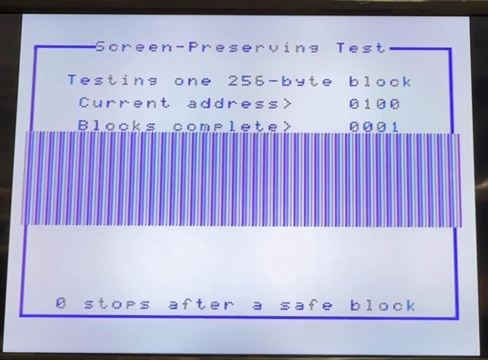
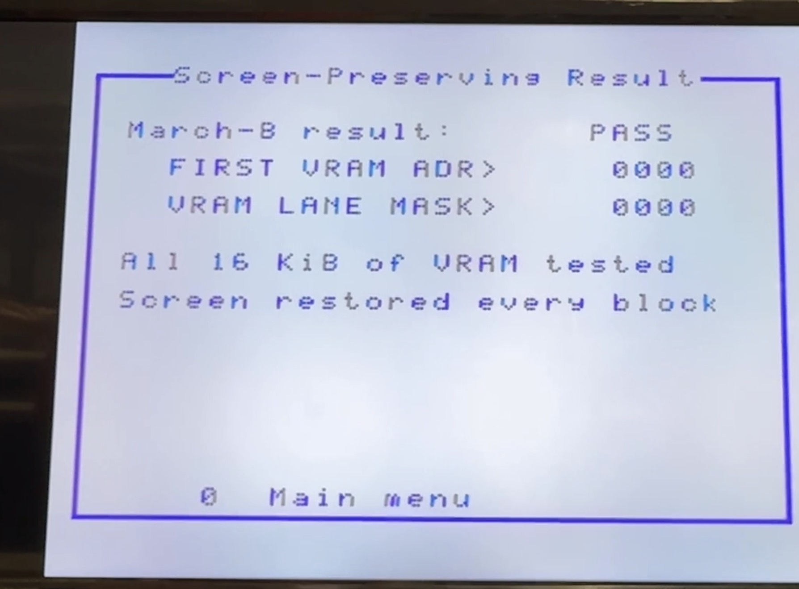

- Modes:

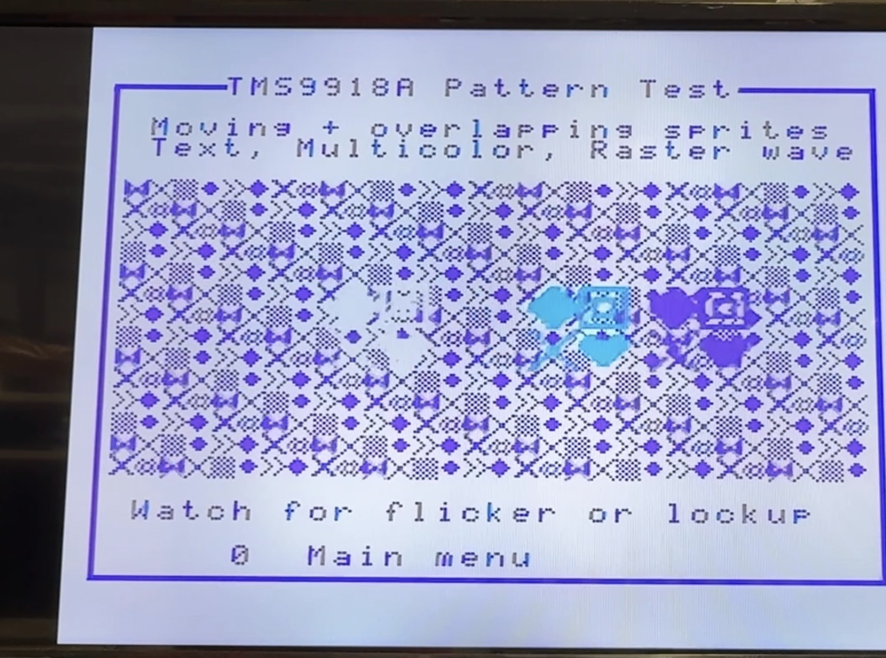
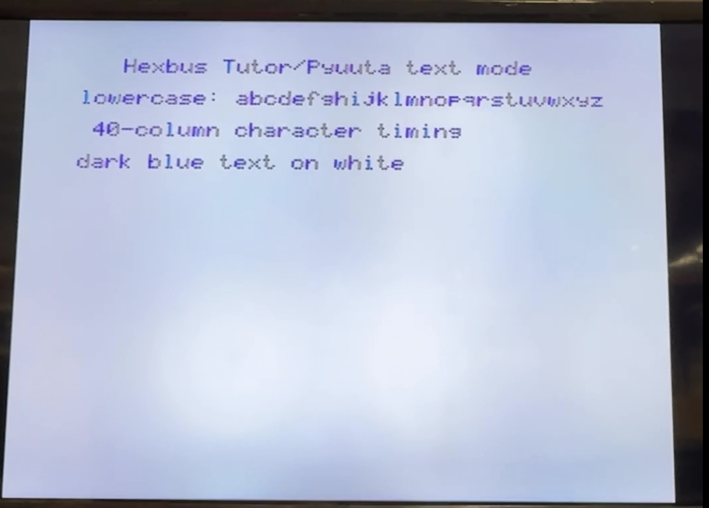
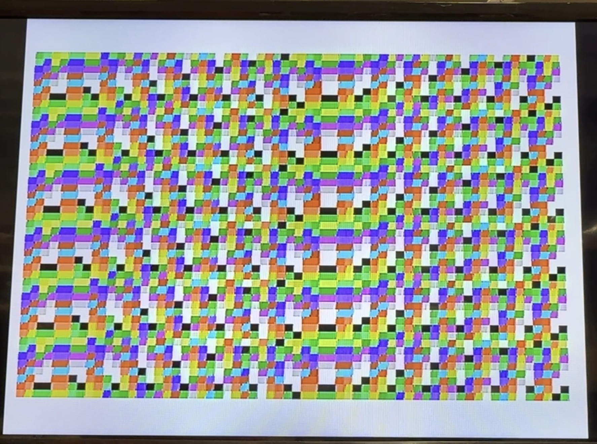
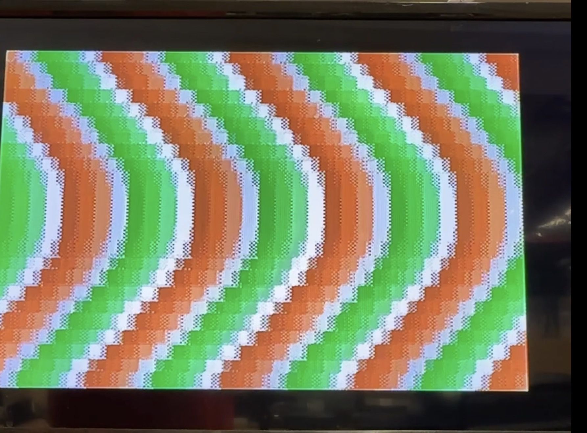
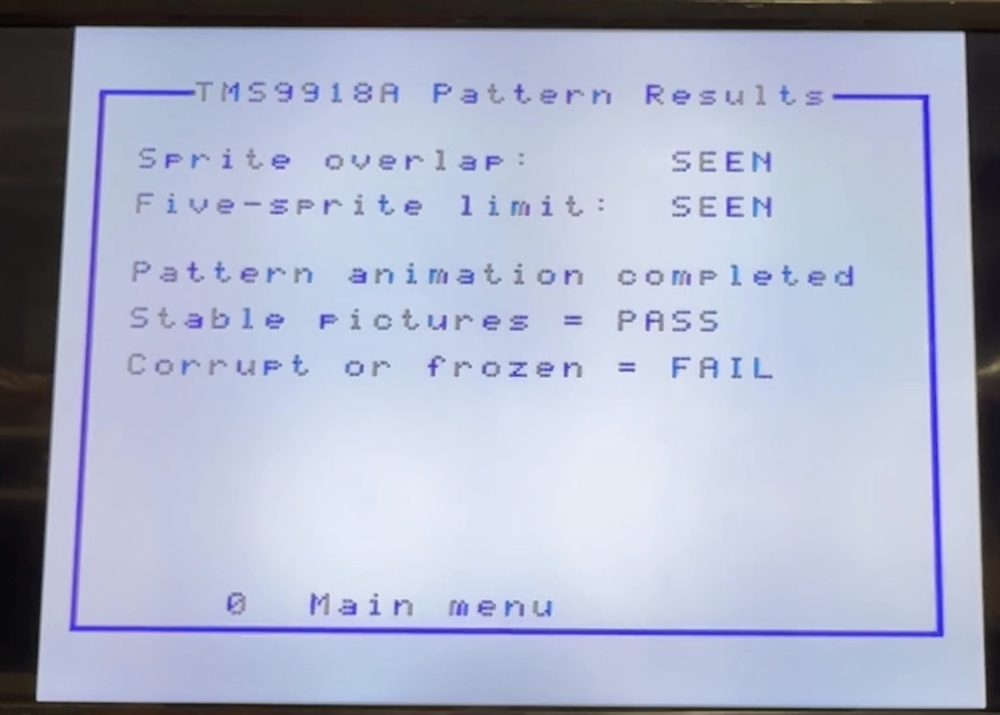

- MarchB:

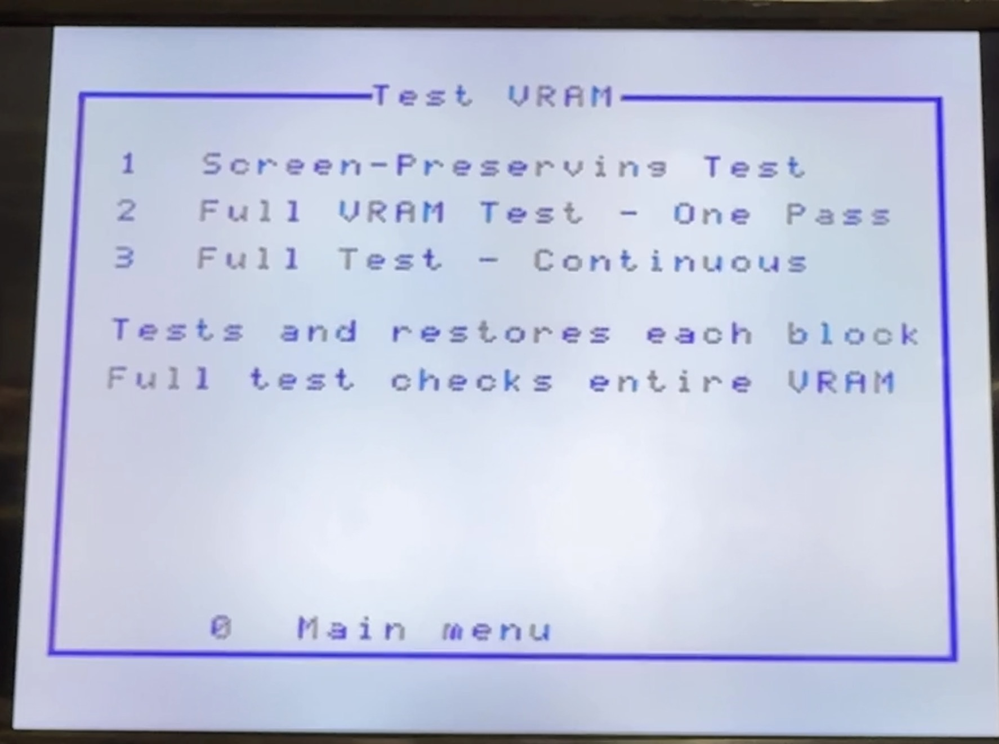
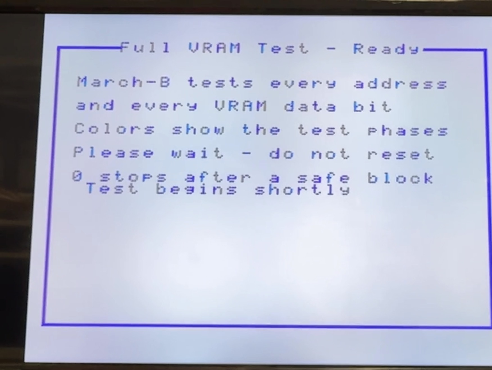
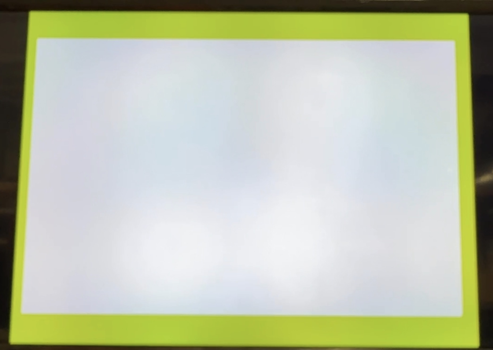
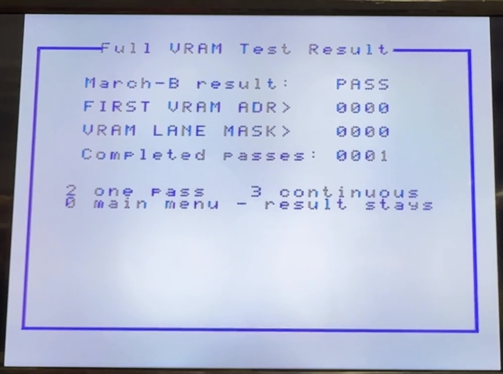

### VRAM physical-lane interpretation

For the supplied mid-production TP1000 schematic (serial cited by the source as ZTST 038881), software bits map in order to VDP `RD0..RD7`, and the eight 4116 positions are drawn left-to-right as `D1, D2, C1, C2, B1, B2, A1, A2`. This is a board-revision-specific lookup, not a universal part-location claim. A failing bit identifies the complete data path for that lane; the DRAM itself, socket, trace, VDP pin, or support logic may be responsible.

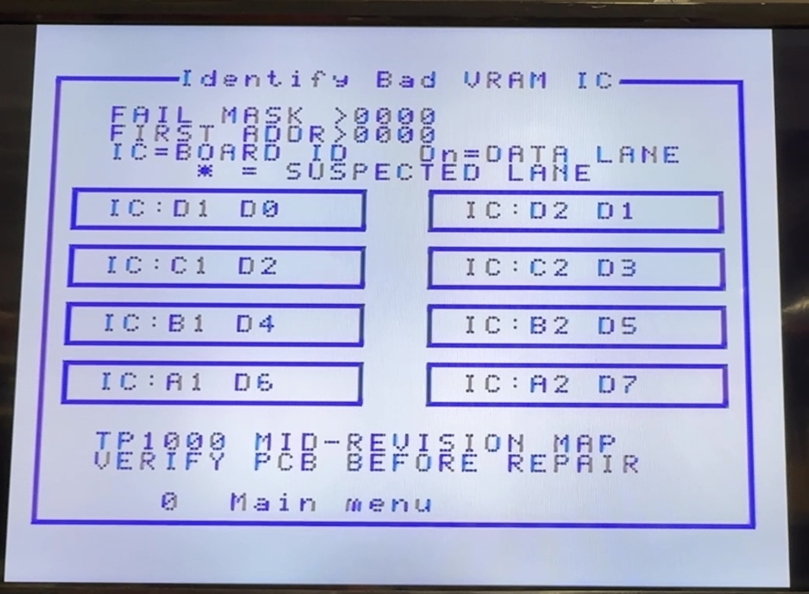

### Human-interactive I/O

- PSG tone channels 0-2, noise modes, attenuation sweep, and a 29.897-second VBlank-timed MegaDemo high-energy loop using an exact 224-frame beat/state boundary, with immediate `0` mute;
- a Graphics-I red/white/green raster wave adapted from MegaDemo bank 18, using eight name-table/color-table phases and transparent-sprite collision timing in eight-line bands;
- an independent keyboard page with all eight raw rows plus a latched decoded name and authoritative row/bit, with separate Tutor and Pyuuta presentation;
- an independent controller page that explicitly selects Player 1 and Player 2 and displays fire/up/down/left/right for each;
- color, text, border, sprite, and motion pages;
- long-running timing/counter page and repeated memory passes.

### Optional expansion

No extension is assumed on a stock machine. Discovery must fail closed and leave unknown hardware unchanged.

- report whether writable storage is independently observable at `>6000->7FFF` and `>C000->DFFF`;
- when both windows pass the save/write/verify/restore probe, show `TANAM: 2 x 8K INDEPENDENT` and the live map;
- report ESE separately only when a reliable signature/decode test is proved; the current ROM must not equate "Tanam present" with "ESE present";
- expose a destructive 17N test only after detection, a warning page, and a second `7` confirmation; test all words in both windows and leave the final March state at zero.

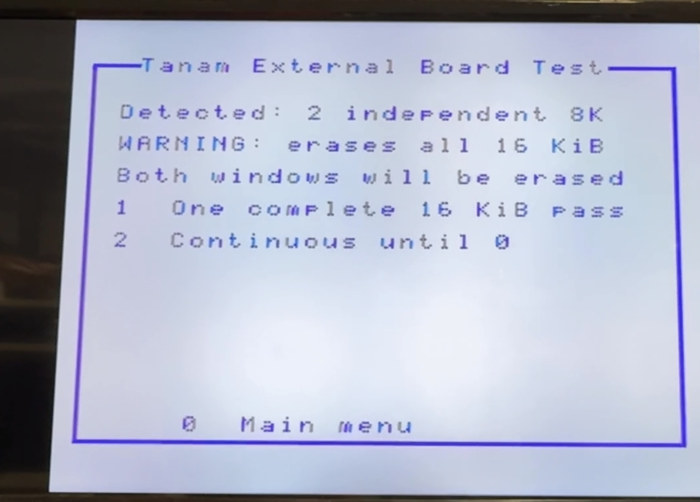
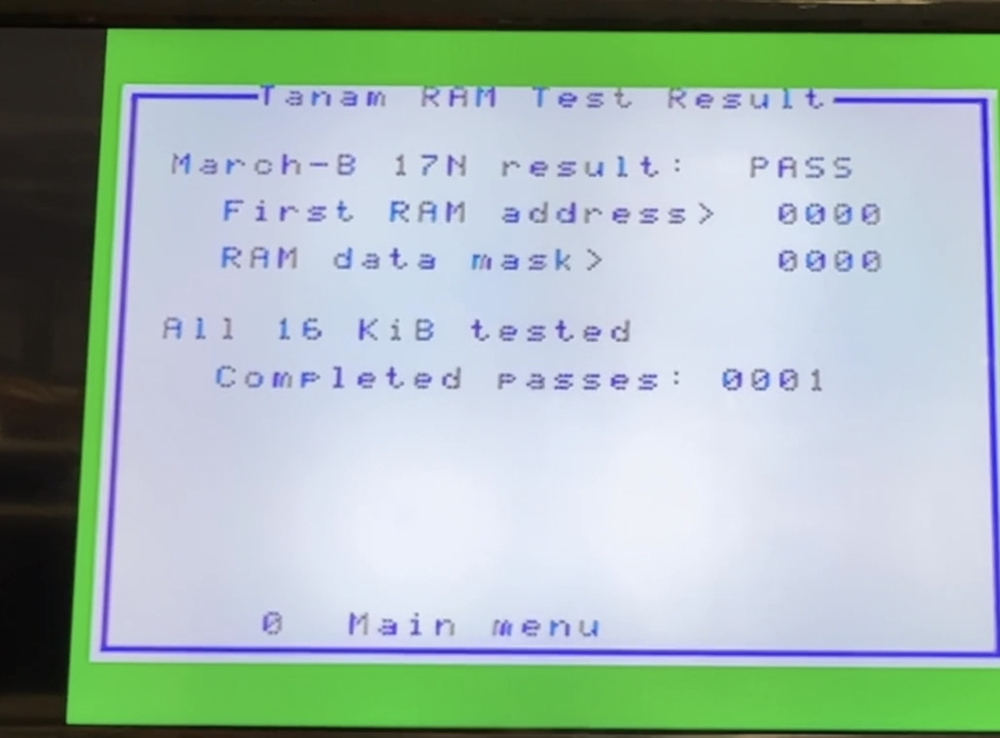

## Memory map shown by the diagnostic

| CPU range | Stock diagnostic interpretation |
| --- | --- |
| `>0000->3FFF` | active 16 KiB diagnostic core |
| `>4000->7FFF` | stock system-ROM decode / model-dependent; Tanam may expose SRAM at `>6000->7FFF` under an expansion profile |
| `>8000->BFFF` | BASIC/cartridge option ROM area |
| `>C000->DFFF` | normally open/expansion; Tanam may expose its second independent 8 KiB SRAM window |
| `>E000`, `>E002` | VDP data and control/status |
| `>E100->E1FF` | stock mapper/control area |
| `>E200` | PSG write port |
| `>E600->E7FF` | extension block, semantics not yet proved |
| `>EC00->EC7E` | keyboard CRU rows |
| matrix rows `>EC40`, `>EC50` | rear controllers: Player 1/2, D/L/U/R and SL/SR contacts |
| `>F000->F0FB` | TMS9995 on-chip RAM |
| `>FFFA->FFFB` | TMS9995 decrementer |
| `>FFFC->FFFF` | TMS9995 NMI vector |

## Rear BIOS-override cartridge concept

This section documents planned hardware, not a v1.0 installation method. The Hexbus diagnostic cartridge is undeveloped, unreleased, and electrically unqualified. Its PCB, continuity records, BOM, and enclosure work belong in the companion [`tomy-diag-cartridge`](https://github.com/hexbus/tomy-diag-cartridge) repository.

The current fixed-purpose concept is a rear expansion card because the documented connector appears to expose the address bus, data bus, `/MEMEN`, `/DBIN`, `/WE`, READY, `/RESET`, `/EXM00`, and `/KILL SROM`. The exact contacts and behavior remain subject to physical continuity and timing qualification on the target machine revision.

The planned compact board has no pass-through connector and no NORMAL mode. Installing it is intended to assert `/KILL SROM` and select the diagnostic BIOS; stock operation requires removing it while power is off. A two-pole DIP switch selects one of four 16 KiB W27C512 banks, with `00` intended as the default diagnostic bank.

The provisional logic does not require an ESE-style GAL. It proposes using `/EXM00` as the 16 KiB chip select and two gates of a 74HCT00 to form `/OE = /EXM00 OR NOT(DBIN)`. A 0-ohm link would assert `/KILL SROM` whenever the board is installed. These are design hypotheses, not released pin assignments or proven compatibility. The card must never drive data while DBIN is inactive or while the internal ROM remains enabled.

Before a PCB is released, continuity-check contacts 38-48 against the exact machine revision, capture `/EXM00`, `/KILL SROM`, `/MEMEN`, `/DBIN`, and READY timing, and prove with a current-limited bench supply and logic analyzer that internal and external ROMs are never enabled together. The existing ESE GAL equations are relevant evidence but are not copied into this design.
